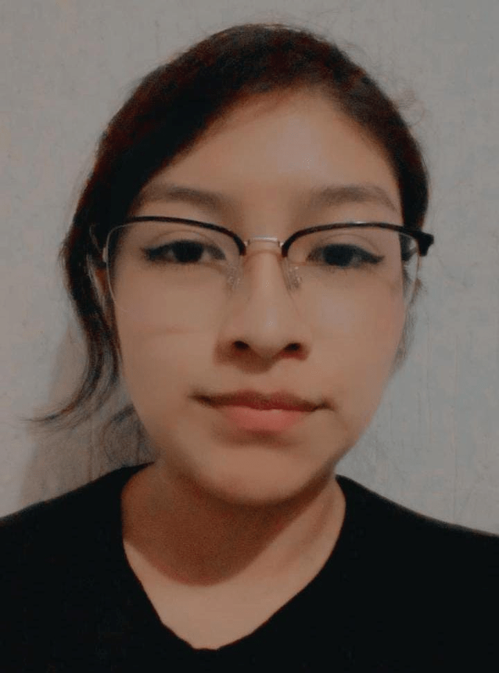

# lizzmdoza.github.oi
Sitio de practicas de clase
<!doctype html>
<html>
<head>
<meta charset="utf-8">
<title>Documento sin título</title>
<link href="css/style_page.css" rel="stylesheet" type="text/css">

</head>

<body>
<header>
  <h1>Elizabeth Jimenez Mendoza</h1>
&nbsp;</header>
<nav>
	<ul id="navegacion">
		<li><a href="html/formatos_texto.html">Formatos de texto</a></li>
		<li><a href="listas.html">Listas</a></li>
		<li><a href="tablas.html">Tablas</a></li>
		<li><a href="enlaces.html">Enlaces</a></li>
		<li><a href="imagenes.html">Imagenes</a></li>
		<li><a href="video.html">Video</a></li>
		<li><a href="audio.html">Audio</a></li>
		<li><a href="formularios.html">Formularios</a></li>
  	</ul>	
</nav>
<main>
  <section>
    
¡Hola! Mi nombre es Elizabeth Jimenez Mendoza, tengo 21 años pero pronto cumplire los 22 años. Soy de Puebla capital, estoy en Septimo Semestre de la carrera de Diseño Gráfico, estudio en la Benemérita Universidad Autónoma de Puebla, mejor conocida como la BUAP.

	   
	

	Apesar de las dificultades, me encanta mi carrera, en mi opinión es una carrera que me permite ser creativa de formas diferentes a las conocidas, me agrada el hecho de tener que ser creativa bajo ciertos parametros, ya que me permite ser mas crítica con lo que hago y darle un propósito, que es algo que suelo hacer cuando realizo alguna actividad o proyecto, ademas de que abarca muchas áreas de las que comúnmente la sociedad nos hace creer.
	

	   
	

	Mis especialidades son la fotografía, la edición editorial, animación 3D y gráficos 2D, ademas del diseño de packing y edición de video. Realmente son áreas que me interesan y en las cuales me quisiera dedicar. Hay otras áreas en las que soy buena pero no me agradan mucho, como la ilustración y diseño de cartel.
	

	 
	

	Me considero una persona perfeccionista y crítica, puesto que me gusta y hago lo necesario por entregar trabajos completos y bien hechos, trato de cuidar cada detalle, ademas de que pongo todo mi esfuerzo. Trabajar en equipo me es fácil, aunque me a veces se me dificulta un poco por las actitudes que algunos compañeros tienden a tomar, pero eso no me impide dar todo de mi.
 	

    &nbsp;</section>
  &nbsp;</main>
<footer>
  <h6>Elaborado por Elizabeth Jimenez Mendoza</h6>
</footer>
</body>
</html>
